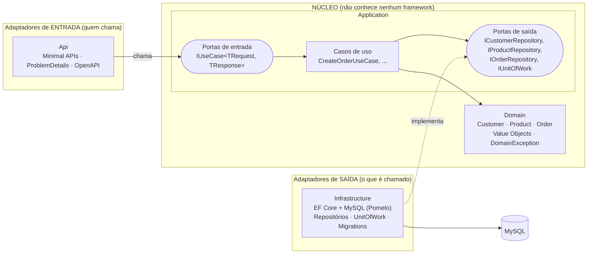

# dotnet-ddd-hexagonal

[](https://github.com/andreccls/dotnet-ddd-hexagonal/actions/workflows/ci.yml)
[](https://dotnet.microsoft.com/)
[](LICENSE)
[](#cobertura)

> 🇬🇧 Short English summary at the [end of this file](#english-summary) (and in [README.en.md](README.en.md)).

**Projeto de exemplo / referência de código** para **DDD + Arquitetura Hexagonal (Ports & Adapters)** em **.NET 9**,
com três CRUDs reais (Clientes, Produtos, Pedidos), MySQL, testes de unidade com cobertura de 100 % nas camadas de
regra de negócio e testes de arquitetura que **quebram o build** se alguém violar a regra de dependência.

Serve de **template**: o passo a passo para adicionar um novo CRUD está em
[docs/ARCHITECTURE.md](docs/ARCHITECTURE.md#como-adicionar-um-novo-crud-passo-a-passo).

Não é um produto: é um exemplo didático. Foi desenhado seguindo **SOLID, KISS e YAGNI** — por isso **não** tem
MediatR, AutoMapper, CQRS completo, event sourcing nem repositório genérico "mágico" (cada escolha está num
[ADR](docs/adr)).

## Arquitetura



**Regra de dependência** (verificada por `Architecture.Tests`): as setas de código apontam sempre para dentro.

```
Api ─────────► Application ─────► Domain
Infrastructure ─► Application ─────► Domain          (Domain: zero dependências)
```

A `Api` referencia `Infrastructure` **somente** no *composition root* (`Program.cs`), para ligar portas a adaptadores.

## Estrutura de pastas

```
.
├── src/
│   ├── DddHexagonal.Domain/          # agregados, value objects, DomainException  (zero dependências)
│   │   ├── Common/                   #   Entity, AggregateRoot, ValueObject, exceções
│   │   ├── Customers/ Products/ Orders/
│   ├── DddHexagonal.Application/     # casos de uso + portas (sem EF, sem ASP.NET)
│   │   ├── Ports/In/                 #   IUseCase<TRequest,TResponse>  (porta de entrada)
│   │   ├── Ports/Out/                #   IXxxRepository, IUnitOfWork   (portas de saída)
│   │   ├── Customers/ Products/ Orders/   # um arquivo por caso de uso (comando + handler)
│   ├── DddHexagonal.Infrastructure/  # adaptador de saída: EF Core + MySQL
│   │   └── Persistence/              #   DbContext, Configurations/, Repositories/, Migrations/
│   └── DddHexagonal.Api/             # adaptador de entrada: Minimal APIs + composition root
│       └── Endpoints/                #   um arquivo por feature
├── tests/
│   ├── DddHexagonal.Domain.Tests/          # regras de domínio (TDD)       — gate 100 %
│   ├── DddHexagonal.Application.Tests/     # casos de uso com fakes        — gate 100 %
│   ├── DddHexagonal.Infrastructure.Tests/  # integração, MySQL real
│   ├── DddHexagonal.Api.Tests/             # ponta a ponta, MySQL real
│   └── DddHexagonal.Architecture.Tests/    # NetArchTest: regra de dependência
├── docs/ (ARCHITECTURE.md, adr/)   scripts/coverage.sh   Makefile   Dockerfile   docker-compose.yml
```

## Como rodar

Pré-requisito: **Docker**. (.NET SDK local é opcional: sem ele, o `Makefile` usa a imagem oficial do SDK.)

```bash
make up                 # sobe MySQL 8.4 + API (migrations aplicadas na partida)
# Swagger UI:  http://localhost:8080/swagger        Health: http://localhost:8080/health
```

> Porta 8080 ou 3306 ocupada? Copie `.env.example` para `.env` e troque `API_PORT` / `MYSQL_PORT`.
> As senhas do `docker-compose.yml`/`.env.example` são **apenas para desenvolvimento**.

Exemplo completo (cliente → produto → pedido):

```bash
H='Content-Type: application/json'
API=http://localhost:8080

CUSTOMER=$(curl -s -H "$H" $API/customers -d '{
  "name":"Maria Silva","email":"maria@example.com","document":"529.982.247-25","phone":"(31) 99999-8888"}' | jq -r .id)

PRODUCT=$(curl -s -H "$H" $API/products -d '{
  "name":"Mechanical Keyboard","sku":"KEY-001","price":249.90,"stock":10}' | jq -r .id)

ORDER=$(curl -s -H "$H" $API/orders -d "{
  \"customerId\":\"$CUSTOMER\",\"items\":[{\"productId\":\"$PRODUCT\",\"quantity\":2}]}" | jq -r .id)

curl -s $API/products/$PRODUCT        # stock: 8  (o pedido reserva estoque)
curl -s -X POST $API/orders/$ORDER/confirm
curl -s -X POST $API/orders/$ORDER/cancel   # devolve o estoque
make down                                   # para tudo (mantém o volume do banco)
```

Erros seguem RFC 7807 (`application/problem+json`): `400` regra de negócio/entrada inválida, `404` não encontrado,
`409` conflito (e-mail/SKU duplicado, alteração concorrente, exclusão de algo referenciado).

## Endpoints

| Recurso | Método e rota | Descrição | Respostas |
|---|---|---|---|
| Customers | `POST /customers` | Cria cliente (e-mail único, CPF validado) | 201 · 400 · 409 |
| | `GET /customers?page=&pageSize=` | Lista paginada | 200 |
| | `GET /customers/{id}` | Consulta | 200 · 404 |
| | `PUT /customers/{id}` | Atualiza | 200 · 400 · 404 · 409 |
| | `POST /customers/{id}/activate` · `/deactivate` | Ativa / desativa | 200 · 400 · 404 |
| | `DELETE /customers/{id}` | Remove (bloqueado se tiver pedidos) | 204 · 404 · 409 |
| Products | `POST /products` | Cria produto (SKU único, preço ≥ 0) | 201 · 400 · 409 |
| | `GET /products?page=&pageSize=` | Lista paginada | 200 |
| | `GET /products/{id}` | Consulta | 200 · 404 |
| | `PUT /products/{id}` | Atualiza nome/SKU/preço | 200 · 400 · 404 · 409 |
| | `POST /products/{id}/stock` | Ajusta estoque (`{"delta": -3}`), nunca negativo | 200 · 400 · 404 · 409 |
| | `DELETE /products/{id}` | Remove (bloqueado se estiver em pedido) | 204 · 404 · 409 |
| Orders | `POST /orders` | Cria pedido (cliente ativo, itens com qtd > 0 e estoque) | 201 · 400 · 404 · 409 |
| | `GET /orders?page=&pageSize=` | Lista paginada (com itens) | 200 |
| | `GET /orders/{id}` | Consulta | 200 · 404 |
| | `PUT /orders/{id}/items` | Troca os itens (só `Pending`) | 200 · 400 · 404 · 409 |
| | `POST /orders/{id}/confirm` | `Pending → Confirmed` | 200 · 400 · 404 |
| | `POST /orders/{id}/cancel` | `Pending/Confirmed → Cancelled` (devolve estoque) | 200 · 400 · 404 |
| | `DELETE /orders/{id}` | Remove (somente `Cancelled`) | 204 · 400 · 404 |
| Plataforma | `GET /health` · `GET /openapi/v1.json` · `GET /swagger` | Saúde (inclui MySQL), documento OpenAPI, Swagger UI | 200 |

Paginação: `page` ≥ 1 (padrão 1), `pageSize` 1–100 (padrão 20); valores fora da faixa são ajustados, não rejeitados.

### Regras de negócio principais

- **Customer**: e-mail único; CPF com dígitos verificadores; telefone opcional; ativar/desativar (repetir a operação é erro).
- **Product**: SKU único (normalizado em maiúsculas); `Money` não negativo; estoque nunca fica negativo
  (e alterações concorrentes de estoque são detectadas por concorrência otimista → 409).
- **Order**: referencia `CustomerId`/`ProductId` **por id**; só cliente **ativo** cria pedido; item exige quantidade > 0 e
  estoque; o preço do produto é gravado no item (snapshot); total é **calculado**, nunca armazenado; só `Pending` é editável;
  criar/alterar reserva estoque e cancelar devolve (tudo numa única unidade de trabalho).

## Testes

```bash
make test        # build (warnings = erro) + TODOS os testes (sobe o MySQL sozinho)
make coverage    # idem + cobertura; FALHA se Domain/Application < 100 % (linhas ou branches)
```

Funciona **sem .NET instalado** (usa `docker compose run sdk`) e **com .NET local** (usa `dotnet` direto; o MySQL
continua vindo do compose). Os testes de integração/E2E leem a variável `TEST_MYSQL_CONNECTION`
(o `Makefile` e o CI já a definem); cada classe de teste cria e destrói o próprio banco `ddd_test_*`/`ddd_api_test_*`.
Para rodar na mão: `make up-db` e depois
`TEST_MYSQL_CONNECTION="Server=127.0.0.1;Port=3306;User=root;Password=dev_only_root_password" dotnet test`.

<a id="cobertura"></a>

### Cobertura (medida em 2026-10-06 com `make coverage`)

196 testes, todos verdes: Domain 96 · Application 48 · Infrastructure 13 · Api 24 · Architecture 15.

| Camada | Linhas | Branches | Política |
|---|---|---|---|
| Domain | 247/247 = **100 %** | 113/113 = **100 %** | **gate** — falha o build abaixo de 100 % |
| Application | 249/249 = **100 %** | 54/54 = **100 %** | **gate** — falha o build abaixo de 100 % |
| Infrastructure | 98/98 = 100 % | — (sem branches) | só relatório (testes de integração) |
| Api | 185/186 = 99,4 % | 21/24 = 87,5 % | só relatório (testes E2E) |

Relatório HTML: `coverage/report/index.html` (gerado por ReportGenerator; no CI vira artefato e resumo do job).

Código **excluído** da cobertura (`[ExcludeFromCodeCoverage]`, sempre com `Justification`):

| Onde | Por quê |
|---|---|
| Construtores sem parâmetros de `Entity`, `AggregateRoot`, `Customer`, `Product`, `Order`, `OrderItem` | Existem só para o EF Core materializar a entidade |
| `DesignTimeDbContextFactory` | Só roda dentro da CLI `dotnet ef` |
| `Persistence/Migrations/*` e `*.g.cs` (via `ExcludeByFile`) | Código gerado (migrations, `GeneratedRegex`) |

## Princípios → onde estão aplicados

| Princípio | Onde no código |
|---|---|
| **S** — Responsabilidade única | Um caso de uso por classe/arquivo (`Orders/CancelOrder.cs`); um endpoint-file por feature; uma `Configuration` EF por agregado |
| **O** — Aberto/fechado | Novo caso de uso = nova classe; `UseCaseRegistration` o registra por convenção, sem editar código existente. Novo adaptador de saída = nova implementação da porta |
| **L** — Substituição de Liskov | `InMemory*Repository` (fakes em `Application.Tests`) e os repositórios EF são intercambiáveis atrás de `I*Repository`; os testes de caso de uso rodam com os dois mundos |
| **I** — Segregação de interfaces | Portas pequenas e específicas: `IUseCase<,>` (1 método), um `IRepository` por agregado, `IUnitOfWork` separado (1 método) |
| **D** — Inversão de dependência | `Application` define as portas; `Infrastructure` as implementa; a ligação acontece só em `Api/Program.cs`. Provado por `Architecture.Tests` |
| **YAGNI** | Sem MediatR/AutoMapper/CQRS/event sourcing/repositório genérico; sem moeda em `Money`; sem eventos de domínio (ver "Próximos passos") |
| **KISS** | `IUseCase<TRequest,TResponse>` simples; erros por exceção → `ProblemDetails`; total do pedido calculado em vez de sincronizado |
| **DRY** | `PagedQueryExtensions`, `PageQuery`/`PagedResult<T>` compartilhados; `OrderStock` centraliza reserva/devolução de estoque; validação **só** nos value objects/agregados (nada duplicado na API) |
| **DDD tático** | Agregados com fábricas estáticas e sem setters públicos; VOs imutáveis (`Email`, `Cpf`, `Phone`, `Sku`, `Money`); referências entre agregados por id; regras invariantes dentro do agregado |

## Documentação

- [docs/ARCHITECTURE.md](docs/ARCHITECTURE.md) — camadas, fluxo de uma requisição, regra de dependência e **como adicionar um novo CRUD**.
- [docs/adr/](docs/adr) — decisões: [hexagonal](docs/adr/0001-hexagonal-architecture.md) ·
  [sem MediatR](docs/adr/0002-no-mediatr-use-case-port.md) · [EF Core + Pomelo](docs/adr/0003-ef-core-with-pomelo-mysql.md) ·
  [Minimal APIs](docs/adr/0004-minimal-apis.md) · [estratégia de testes](docs/adr/0005-testing-strategy.md).

## Limitações conhecidas e próximos passos

- **Eventos de domínio** (ex.: `OrderConfirmed`) foram omitidos: nada os consumiria hoje (YAGNI). O ponto natural é
  `AggregateRoot` guardar uma lista de eventos e o `UnitOfWork` publicá-los após o `SaveChanges`.
- **Sem autenticação/autorização** e sem *rate limiting*: é um exemplo de arquitetura, não um produto.
- **Migrations na partida** (`Database:MigrateOnStartup`) é conveniência de dev/demo; em produção, rode como job separado.
- Concorrência otimista só no estoque do produto; pedidos concorrentes no mesmo registro podem usar o mesmo mecanismo.
- Os Swagger/OpenAPI ficam sempre ligados porque é uma demo.
- O modo "com .NET local" do `Makefile` não foi exercitado no ambiente de desenvolvimento original (sem SDK no Mac);
  a execução via Docker é a validada.

## Licença

[MIT](LICENSE) © André Coura

<a id="english-summary"></a>

## English summary

A reference implementation of **DDD + Hexagonal Architecture (Ports & Adapters)** on **.NET 9** with three CRUDs
(Customers, Products, Orders) over MySQL (EF Core + Pomelo). Domain and Application are framework-free and covered
100 % (line and branch, enforced as a build gate); `NetArchTest` tests enforce the dependency rule; the API uses Minimal
APIs with RFC 7807 errors. Run `make up` (Docker only), then open `http://localhost:8080/swagger`. `make test` and
`make coverage` work with or without a local .NET SDK. See [README.en.md](README.en.md) and
[docs/ARCHITECTURE.md](docs/ARCHITECTURE.md) (Portuguese) for details.
